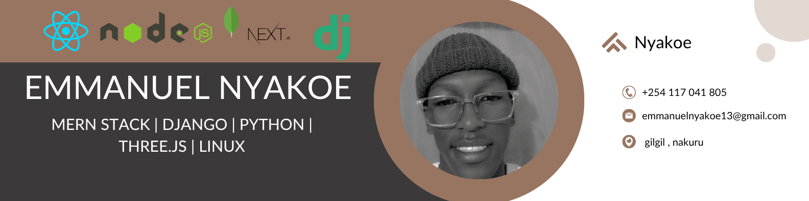

<!-- README.md -->

  

<h1 align="center">👋 Hi there, I'm Emmanuel Nyakoe</h1>

  💻 Full Stack Developer | 🎨 Creative Coder | 🏉 Rugby Lover | 🏋️‍♂️ Fitness Enthusiast  
  📍 Kenya &nbsp; | &nbsp; 📧 <a href="mailto:emmanuelnyakoe13@gmail.com">emmanuelnyakoe13@gmail.com</a> &nbsp; | &nbsp; 📱 0117041805

---

<h2 align="center">✨ About Me</h2>

  🔭 Building <b>3D web experiences</b> with Three.js, React & GSAP  
  🌱 Learning <b>React Three Fiber, Next.js & animations</b>  
  🎓 Proud learner at <b>PLP Academy</b>  
  🧠 Skilled in <b>Django, MERN Stack, JavaScript & Python</b>  
  💪 Passionate about <b>rugby, coding and working out</b>

---

<h2 align="center">🛠 Tech Stack & Tools</h2>

  
  
  
  
    
  
  
  
    
  
  
  
  

---
<h2 align="center">📈 Tech Mastery</h2>

| Skill                | Proficiency         |
|----------------------|---------------------|
| MERN Stack           |  |
| Django               |  |
| Python               |  |
| React Three Fiber    |  |
| GSAP Animations      |  |

---

<h2 align="center">📈 Skills Radar</h2>

  

---

<h2 align="center">📫 Let’s Connect!</h2>

  
  
  

---

<h2 align="center">⚡ Fun Fact</h2>

  I play rugby like I write code — <b>aggressively clean and full of passion!</b> 🏉💻

  

---

  

