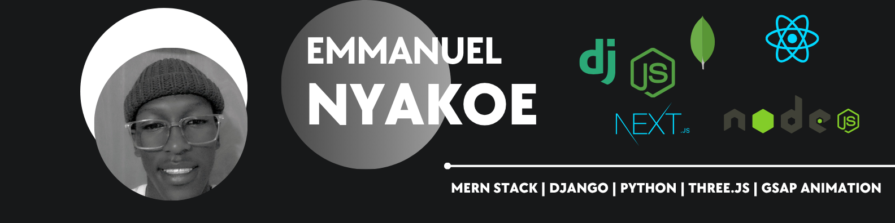
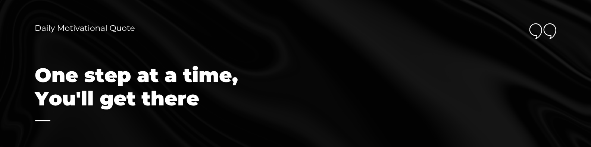

<!-- README.md -->

  

<h1 align="center">👋 Hey, I'm Emmanuel Nyakoe</h1>

  💻 Full Stack Developer & Creative Coder  
  🏉 Rugby Fanatic | 🏋️‍♂️ Fitness Junkie  
  📍 Kenya | 📧 <a href="mailto:emmanuelnyakoe13@gmail.com">emmanuelnyakoe13@gmail.com</a> | 📱 0117041805

---

<h2 align="center">✨ About Me</h2>

  🚀 Building immersive <b>3D web experiences</b> with Three.js, React, and GSAP  
  🌱 Currently mastering <b>React Three Fiber, Next.js, & slick animations</b>  
  🎓 Lifelong learner @ <b>PLP Academy</b>  
  🧩 Skilled in <b>Django, MERN Stack, JavaScript, & Python</b>  
  💪 Powered by <b>rugby, code, and the gym</b>

---

<h2 align="center">🛠️ Tech Toolbox</h2>

  
  
  
  
    
  
  
  
    
  
  
  
  

---

<h2 align="center">📈 Stats & Insights</h2>

  
  

---

<h2 align="center">🌍 Connect With Me</h2>

  
  
  

---

<h2 align="center">⚡ Fun Fact</h2>

  I tackle bugs like I tackle opponents — <b>full speed, zero fear!</b> 🏉🐞💻

---

  

